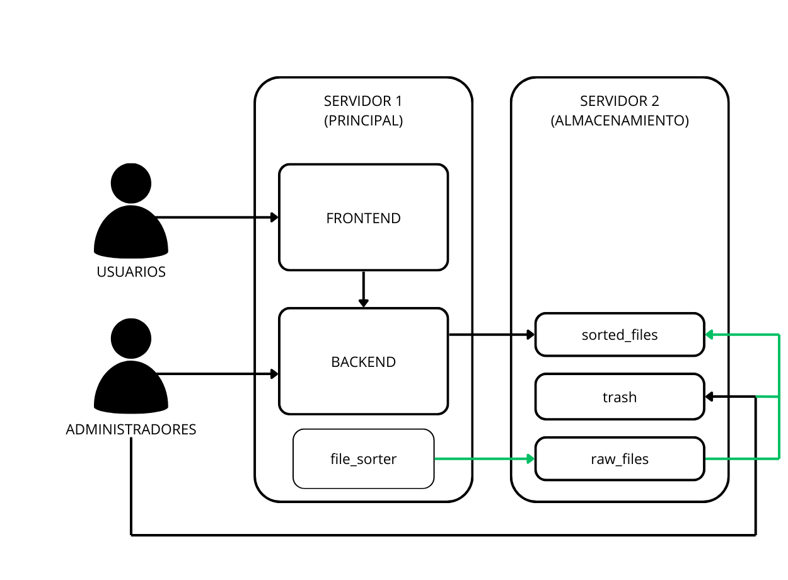

# Sistema de Gestión Documental ARCA

## 1. Introducción

### 1.1 Propósito y Descripción del Sistema

El presente documento técnico tiene como finalidad documentar la arquitectura, configuración y operación del Sistema de Gestión Documental ARCA, una solución integral para la administración de comprobantes electrónicos emitidos ante la DIAN.

ARCA es una plataforma empresarial diseñada para la gestión integral de documentos fiscales, incluyendo facturas, notas crédito, notas débito y soportes de adquisición. El sistema facilita la búsqueda, visualización y descarga de documentos en formatos estándar (PDF/XML), garantizando el cumplimiento de los requisitos legales vigentes.

La plataforma integra un módulo avanzado de administración de usuarios y control de acceso basado en roles, segmentado por ubicaciones geográficas. Se encuentra interconectado con la base de datos del sistema SEVEN, utilizado actualmente por la FEDERACIÓN NACIONAL DE ARROCEROS FEDEARROZ, para la sincronización de datos relacionados con las ubicaciones de emisión de facturas y el directorio de proveedores.

### 1.2 Alcance

El sistema ARCA abarca las siguientes funcionalidades principales:

- Búsqueda avanzada de comprobantes electrónicos
- Gestión documental con capacidad de descarga en múltiples formatos
- Administración centralizada de usuarios y perfiles de acceso
- Control de permisos granulares por ubicación y funcionalidad
- Módulo de carga masiva de documentos

El presente documento técnico detalla la arquitectura, configuración y procedimientos operativos del sistema de búsqueda y repositorio documental ARCA.

### 1.3 Público Objetivo

Este documento está dirigido al equipo de desarrollo de FEDEARROZ responsable del mantenimiento, actualización y mejora continua del sistema ARCA, así como a los administradores de sistemas involucrados en su implementación y soporte.

## 2. Arquitectura del Sistema

### 2.1 Diagrama de Arquitectura



### 2.2 Stack Tecnológico

#### 2.2.1 Frontend

La capa de presentación del sistema ha sido desarrollada utilizando tecnologías modernas de desarrollo web:

- **Vue 3** - Framework progresivo para la construcción de interfaces de usuario interactivas
- **Vite** - Herramienta de construcción de frontend de próxima generación
- **Pinia** - Solución de gestión de estado para aplicaciones Vue
- **Axios** - Cliente HTTP basado en promesas para operaciones asíncronas
- **Vue Router** - Sistema de enrutamiento oficial para aplicaciones Vue.js
- **JSZip** - Biblioteca para manipulación de archivos ZIP directamente en el navegador
- **Vite Plugin Vue Devtools** - Extensión para depuración en entorno de desarrollo

#### 2.2.2 Backend

El backend del sistema está construido sobre las siguientes tecnologías:

- **Python 3.13** - Lenguaje de programación de alto nivel
- **FastAPI (0.115.4)** - Framework web moderno para el desarrollo de APIs RESTful
- **Uvicorn (0.32.0)** - Servidor ASGI de alto rendimiento
- **SQLAlchemy (2.0.36)** - ORM para interacción con bases de datos relacionales
- **Pydantic (2.11.1)** - Validación de datos y configuración tipada
- **PyMySQL (1.1.1) / mysqlclient (2.2.5)** - Conectores para bases de datos MySQL
- **python-dotenv (1.1.0)** - Gestión de variables de entorno
- **python-jose (3.4.0)** - Implementación de autenticación JWT
- **bcrypt (4.2.0)** - Algoritmo de hashing seguro para contraseñas
- **passlib (1.7.4)** - Utilidades avanzadas para manejo de credenciales
- **requests (2.32.3)** - Cliente HTTP para integraciones externas
- **pandas (2.2.3)** - Biblioteca para análisis y manipulación de datos
- **py7zr (1.0.0)** - Soporte para compresión/descompresión 7z
- **python-multipart (0.0.17)** - Manejo de formularios multiparte

### 2.2 Patrones de diseño

#### 2.2.1 Frontend

- **Pinia** - Patrón de gestión de estado para aplicaciones Vue

#### 2.2.2 Backend

- **FastAPI** - Patrón de diseño para construir APIs

## 3. Configuración del Entorno

### 3.1 Requisitos del sistema

### 3.1.1 Servidor Principal

- **Windows Server 2016** - Sistema operativo
- **Python 3.13** - Lenguaje de programación del backend y del file_sorter
- **XAMPP** - Servidor web
- **MySQL** - Base de datos
- **Git/Github Desktop** - Control de versiones
- **8-16GB de RAM** - Memoria RAM
- **Procesador Dual Core** - Procesador
- **Disco Duro con al menos 100GB de espacio** - Disco duro
- **Chorme** - Navegador web
- **Node.js/Vue** - Framework de JavaScript progresivo para construir interfaces de usuario usado en el Frontend

### 3.1.2 Servidor Secundario

- **Irrelevante** - Sistema operativo
- **2-4TB** - Disco duro para almacenamiento de archivos masivo
- **2-4GB de RAM** - Memoria RAM
- **Procesador Dual Core** - Procesador
- **Carpeta arca_repo** - Carpeta compartida mediante red para almacenamiento de archivos masivo a la que se conectara el file_sorter
- **File Sorter** - Programa que ordena los archivos masivos

### 3.2 Instalación de dependencias

#### 3.2.1 Frontend

**npm install** - Instala las dependencias del frontend desde el package.json

#### 3.2.2 Backend

**pip install -r requirements.txt** - Instala las dependencias del backend desde el requirements.txt

#### 3.2.3 File Sorter

**pip install -r requirements.txt** - Instala las dependencias del file sorter desde el requirements.txt (Ejecutar en el directorio del file sorter dentro de la carpeta del backend)

### 3.3 Variables de entorno

#### 3.3.1 Frontend

- **VITE_API_URL** = URL del backend (Ejemplo: http://194.168.0.57:8000)
- **VITE_SUPPORT_NUMBER** = Numero de soporte (Ejemplo: 3219231178)
- **VITE_SUPPORT_EMAIL** = Email de soporte (Ejemplo: davidcarrillo@fedearroz.com.co)

#### 3.3.2 Backend

- **SECRET_KEY** = Clave secreta con la que se encriptan los tokens y contraseñas (Ejemplo: 1019983157)
- **SORTED_FILES_PATH** = Ruta de los archivos ordenados (Ejemplo: \\194.168.0.22\arca repo\sorted_files)
- **RAW_FILES_PATH** = Ruta de los archivos raw (Ejemplo: \\194.168.0.22\arca repo\raw_files)
- **DATABASE_URL** = URL de la base de datos (Ejemplo: mysql+pymysql://root:@localhost/arca_db)
- **ENVIRONMENT** = Entorno (development)
- **DEBUG** = Debug (True)

#### 3.3.3 File Sorter

El **FILE_SORTER** funciona de manera independiente del entorno y no necesita de variables de entorno

## 4. Estructura del Proyecto

### 4.1 Descripcion de directorios

#### 4.1.1 Frontend

```
ARCA-FRONTEND/                 # Frontend del sistema
├── .vscode/                  # Configuración de Visual Studio Code
├── node_modules/             # Dependencias del frontend
├── public/                   # Archivos públicos
└── src/                      # Código fuente
    ├── assets/               # Archivos estáticos
    │   ├── doc_img/          # Imágenes de documentación
    │   └── images/           # Imágenes de la aplicación
    ├── components/           # Componentes reutilizables
    ├── views/                # Vistas principales
    ├── stores/               # Gestión de estado (Pinia)
    ├── router/               # Configuración de rutas
    ├── App.vue               # Componente raíz de la aplicación
    └── main.js               # Punto de entrada de la aplicación
├── vite.config.js            # Configuración de Vite
├── package.json              # Dependencias y scripts
└── .env                      # Variables de entorno
```

#### 4.1.2 Backend

```
ARCA-BACKEND/                 # Backend del sistema
├── .vscode/                  # Configuración de Visual Studio Code
├── ARCA_FS/                  # File Sorter para organización de archivos
├── main.py                   # Aplicación principal (endpoints API)
├── requirements.txt          # Dependencias de Python
└── .env                      # Variables de entorno
```

### 4.2 Componentes principales

#### 4.2.1 Frontend

```
src/
├── components/               # Componentes reutilizables
│   ├── NewUserWindows.vue    # Formulario de creación de usuarios
│   ├── AlertContainer.vue    # Contenedor de notificaciones
│   ├── AlertItem.vue         # Componente individual de alerta
│   ├── UploadFilesWindows.vue # Interfaz de carga de archivos
│   └── HelpButton.vue        # Botón de ayuda contextual
│
├── views/                    # Vistas principales
│   ├── UsersView.vue         # Gestión de usuarios
│   ├── LogsView.vue          # Visualización de registros
│   ├── SearchView.vue        # Búsqueda de comprobantes
│   └── LoginView.vue         # Autenticación de usuarios
│
└── stores/                   # Gestión de estado (Pinia)
    ├── auth.js              # Estado de autenticación
    ├── files.js             # Gestión de archivos
    ├── logs.js              # Registros del sistema
    ├── suppliers.js         # Datos de proveedores
    ├── users.js             # Gestión de usuarios
    └── useAlerts.js         # Utilidades de notificaciones
```

#### 4.2.2 Backend

```
ARCA-BACKEND/                 # Backend del sistema
├── main.py                   # Aplicación principal (endpoints API)
├── models.py                 # Modelos de base de datos
├── schemas.py                # Esquemas de validación
├── crud.py                   # Operaciones CRUD
├── auth.py                   # Autenticación
├── config.py                 # Configuración
├── database.py               # Base de datos
├── file_searcher.py          # Buscador de archivos que se conecta con el servidor de almacenamiento
├── logs_crud.py              # Operaciones CRUD de logs de descargas
├── seven_suppliers.py        # Operaciones con SEVEN ERP
```

#### 4.2.3 File Sorter

```
ARCA-BACKEND/ARCA_FS/                 # File Sorter del sistema
├── file_sorter.py                   # Organizador de achivos de alto trafico
```

### 4.3 Flujos de datos

#### 4.3.1 Frontend

1. **Autenticación**
   - El usuario ingresa credenciales en `LoginView.vue`
   - `auth.js` procesa la autenticación mediante una petición POST al endpoint `/login`
   - El token JWT recibido se almacena en el estado de Pinia y en localStorage
   - Se redirige al usuario a la vista principal (`SearchView.vue`)

2. **Búsqueda de Comprobantes** (`SearchView.vue`)
   - El usuario ingresa parámetros de búsqueda (fechas, número de factura, etc.)
   - `files.js` gestiona las peticiones al backend para buscar comprobantes
   - Los resultados se almacenan en el estado de Pinia y se muestran en la interfaz
   - Se registra la acción en `logs.js`

3. **Gestión de Usuarios** (`UsersView.vue`)
   - Los administradores pueden ver, crear y gestionar usuarios
   - `users.js` maneja las peticiones CRUD de usuarios
   - Las acciones se registran en el sistema de logs

4. **Visualización de Logs** (`LogsView.vue`)
   - Muestra el historial de acciones del sistema
   - `logs.js` se encarga de obtener los registros del backend
   - Permite filtrar y buscar en los registros

5. **Notificaciones**
   - `useAlerts.js` gestiona las notificaciones globales
   - Se integra con todas las vistas para mostrar mensajes al usuario
   - Soporta diferentes tipos de alertas (éxito, error, advertencia, información)
   - Soporta alertas que se cierran solas y alertas que tienen que ser cerradas por el usuario

6. **Flujo de Datos**

   ```
   Vistas (Vue Components)
   → Stores (Pinia)
   → API (Axios)
   → Backend (FastAPI)
   → Base de Datos (MYSQL)
   ```

7. **Gestión de Estado**
   - Pinia se utiliza como store centralizado
   - Cada módulo (auth, files, users, logs) tiene su propio store
   - El estado se mantiene sincronizado entre componentes

#### 4.3.2 Backend

1. **Arquitectura**
   - API RESTful con FastAPI
   - Autenticación JWT
   - Base de datos relacional (MySQL)
   - ORM SQLAlchemy

2. **Módulos Principales**
   - `auth.py`: Manejo de autenticación y autorización
   - `crud.py`: Operaciones CRUD para usuarios y archivos
   - `logs_crud.py`: Gestión de registros de actividad
   - `models.py`: Modelos de base de datos
   - `schemas.py`: Esquemas Pydantic para validación
   - `file_searcher.py`: Búsqueda y gestión de archivos
   - `ARCA_FS/file_sorter.py`: Procesamiento automático de archivos

3. **Flujo de Datos**
   - Los clientes realizan peticiones HTTP a los endpoints de la API
   - Middleware de autenticación valida los tokens JWT
   - Los controladores procesan las solicitudes y validan los datos
   - Los servicios implementan la lógica de negocio
   - Los modelos interactúan con la base de datos
   - Las respuestas se serializan y devuelven al cliente

4. **Seguridad**
   - Autenticación JWT
   - CORS configurado
   - Validación de entrada estricta
   - Manejo seguro de contraseñas con bcrypt

5. **Rendimiento**
   - Conexiones a base de datos agrupadas
   - Consultas optimizadas
   - Manejo asíncrono de tareas pesadas
   - Caché de consultas frecuentes

6. **Logging y Monitoreo**
   - Registro estructurado de eventos
   - Métricas de rendimiento
   - Alertas para errores críticos
   - Auditoría de operaciones

#### 4.3.3 FileSorter Service

El FileSorter es un servicio autónomo que se encarga del procesamiento automático de archivos en el sistema. Su flujo de trabajo es el siguiente:

1. **Monitoreo de Carpetas**
   - Observa continuamente los directorios configurados en busca de nuevos archivos
   - Detecta cambios en tiempo real usando `watchdog`
   - Agrupa archivos para procesamiento por lotes

2. **Procesamiento de Archivos**
   - **Análisis**: Extrae metadatos de los nombres de archivo usando expresiones regulares
   - **Clasificación**: Determina el tipo de documento y su destino final
   - **Validación**: Verifica la integridad y formato de los archivos
   - **Procesamiento en Paralelo**: Usa múltiples hilos para procesar archivos simultáneamente

3. **Gestión de Errores**
   - Reintentos automáticos para archivos con errores
   - Mueve archivos no válidos a una carpeta de cuarentena
   - Registra errores detallados para su revisión

4. **Integración con Base de Datos**
   - Consulta información de ubicaciones en la base de datos
   - Actualiza metadatos de archivos procesados
   - Mantiene un registro de auditoría de operaciones

5. **Características de Rendimiento**
   - Procesamiento por lotes para optimizar el rendimiento
   - Manejo eficiente de memoria para grandes volúmenes de archivos
   - Límites configurables de recursos del sistema

6. **Estructura del Código**
   - `file_sorter.py`: Módulo principal con la lógica de procesamiento

## 5. Guía de Desarrollo

### 5.1 Estándares de código

#### 5.1.1 Frontend (Vue 3 + JavaScript/TypeScript)

1. **Estructura de Componentes**
   - Usar Composition API con `<script setup>`
   - Orden lógico en los bloques de código: `script` → `template` → `style`
   - Componentes por archivo: un componente por archivo `.vue`
   - Nombre de archivos en PascalCase (ej: `UserProfile.vue`)

2. **Convenciones de Código**
   - Indentación: 2 espacios
   - Comillas simples para strings
   - Punto y coma al final de cada declaración
   - Uso de punto y coma en objetos y arrays

3. **Estilo de Código**
   - Variables y funciones en camelCase
   - Componentes en PascalCase
   - Constantes en UPPER_SNAKE_CASE

4. **Manejo de Estado**
   - Usar Pinia para gestión de estado global
   - Separar la lógica de negocio en stores
   - Usar `ref` para valores reactivos

5. **Rendimiento**
   - Implementar paginación para listas grandes

6. **Seguridad**
   - Validar todas las entradas del usuario
   - Escapar datos dinámicos en templates

#### 5.1.2 Backend (Python + FastAPI)

1. **Convenciones de Código**
   - **Rutas**: Definidas en `main.py` con prefijos lógicos (`/users`, `/files`, etc.)
   - **Modelos**: En `models.py` con nombres en PascalCase (ej: `User`, `DownloadedLog`)
   - **Variables y funciones**: En snake_case
   - **Constantes**: En UPPER_SNAKE_CASE en el módulo correspondiente
   - **Tipado**: Usar type hints en todas las funciones y métodos
   - **Docstrings**: Formato Google Style para documentación de funciones

2. **Manejo de Datos**
   - **Modelos SQLAlchemy**: Para la capa de acceso a datos
   - **Esquemas Pydantic**: Para validación de entrada/salida
   - **Paginación**: Implementada en todos los endpoints que devuelven listas
   - **Filtrado**: Parámetros de consulta para búsquedas específicas

3. **Seguridad**
   - **Autenticación**: JWT con tokens de acceso
   - **Autorización**: Basada en roles (admin/user)
   - **CORS**: Configurado para permitir solicitudes desde el frontend
   - **Variables de entorno**: Usar para datos sensibles
   - **Contraseñas**: Almacenadas con hash seguro (bcrypt)

4. **Rendimiento**
   - **Conexiones a BD**: Usar sesiones SQLAlchemy eficientemente
   - **Tareas en segundo plano**: Usar `BackgroundTasks` para operaciones largas
   - **Búsquedas**: Índices en campos de búsqueda frecuentes
   - **Logging**: Registro de operaciones importantes

5. **Manejo de Archivos**
   - **Subidas**: Validar tipo y tamaño de archivos
   - **Almacenamiento**: Estructura de directorios organizada
   - **Descargas**: Streaming para archivos grandes
   - **Logging**: Registrar toda descarga de archivos

#### 5.1.3 Convenciones de Commits

```
tipo(ámbito): descripción breve

detalles opcionales

[Optional footer(s)]
```

**Tipos de commit:**

- `feat`: Nueva característica
- `fix`: Corrección de errores
- `docs`: Cambios en la documentación
- `style`: Cambios de formato (puntos y comas, indentación, etc.)
- `refactor`: Cambios que no corrigen errores ni agregan funcionalidades
- `perf`: Mejoras de rendimiento
- `test`: Adición o modificación de pruebas
- `chore`: Cambios en el proceso de construcción o herramientas auxiliares

#### 5.1.4 Proceso de Contribución

1. Crear una rama a partir de `main`
2. Realizar cambios atómicos
3. Escribir pruebas unitarias
4. Actualizar documentación si es necesario
5. Ejecutar linters y pruebas
6. Crear un Pull Request con descripción detallada

## 6. Despliegue

### 6.1 Build y Compilación

#### 6.1.1 Frontend

1. Ejecutar `npm run dev` en el servidor de produccion (Configuraciones realizadas para mantener produccion aun usando `dev`)
2. La ruta en la que se desplegara es localhost:8081 o {ip del servidor}:8081
3. Tener en cuenta que el servidor debe tener instalado node.js y npm
4. Tener en cuenta que el servidor debe estar configurado para escuchar y emitir de manera publica el puerto 8081

#### 6.1.2 Backend

1. Ejecutar `uvicorn main:app --host 0.0.0.0 --port 8000 --reload` en el servidor de produccion
2. La ruta en la que se desplegara es localhost:8000 o {ip del servidor}:8000
3. Tener en cuenta que el servidor debe tener instalado python
4. Tener en cuenta que el servidor debe estar configurado para escuchar y emitir de manera publica el puerto 8000

#### 6.1.3 FileSorter

1. Ejecutar `python file_sorter.py` en el servidor de produccion
2. En el archivo file_sorter.py debes configurar las variables de la ruta raw_files, sorted_files y trash del servidor de almacenamiento
3. El servidor de almacenamiento debe compartir por red la carpeta al usuario que ejecute el fil_sorter en el servidor principal
4. Tener en cuenta que el servidor debe tener instalado python
5. Tener en cuenta que el servidor debe estar configurado para escuchar y emitir de manera publica el puerto 8000

### 6.2 Builds y Nuevas Versiones

1. Despues del proceso detallado en el numeral 5.1.4
2. Se accede mediante conexion remota al servidor principal, se bare Git/GitHub Desktop y se bajan los cambios de la rama main

## 7. API Documentation

La documentacion de la API se crea en automatico por FastAPI al desplegar el backend y se puede acceder a ella mediante {url del backend}/docs

## 8. Troubleshooting

### 8.1 Errores comunes

#### 8.1.1 Error de subida de archivos

Madiante la interfaz de usuario para subir archivos al file_sorter, hay cierta limitacion en la cantidad de archivos que dependera del sistema operativo y la cantidad de memoria RAM disponible.

#### 8.1.2 Error, el usuario no le carga la informacion despues de un tiempo

Debido al sistema de autrenticacion, diseñado para mantener una sesion activa por maximo 30 minutos, si el usuario deja la pagina en segundo plano y su sesion se vence en este lapso, el usuario no podra cargar la informacion.

#### 8.1.3 El file_sorter no clasifica los archivos

El file_sorter despues de ser ejecutado y organizar `X` cantidad de archivos, puede que se detenga por problemas de rendimiento. La solucion es en su consola, presionar `Ctrl + C` para detenerlo y ejecutarlo de nuevo.

### 8.2 Soluciones

#### 8.2.1 Solucion de subida de archivos

Con grandes cantidades de archivos, acceder directamente al servidor de almacenamiento y mover los archivos a la carpeta raw_files del file_sorter.

#### 8.2.2 Solucion de sesion vencida

Recargar la pagina para iniciar una nueva sesion.

### 8.3 Logs y monitoreo

En la consola del backend podran ver el registro de todas sus consultas y operaciones.

En la consola del file_sorter podran ver el registro de los archivos organizados y sus velocidades.
